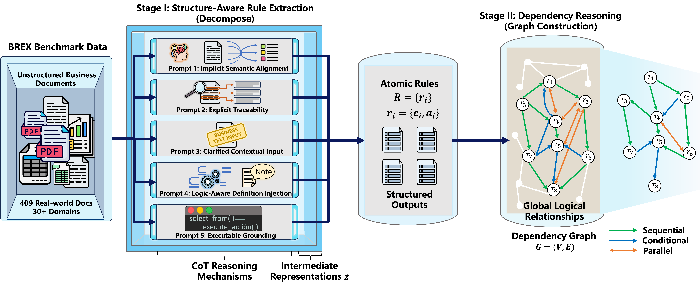

# Business as Rulesual: A Benchmark and Framework for Business Rule Flow Modeling with LLMs

[](https://acl2026.org/)
[](https://opensource.org/licenses/MIT)
[](#dataset)

**[Paper]** | **[Dataset]** | **[Project Page]**

> **Note:** This repository contains the code and dataset for the paper "Business as Rulesual: A Benchmark and Framework for Business Rule Flow Modeling with LLMs", submitted to ACL 2026.

## 📖 Abstract

Extracting structured procedural knowledge from unstructured business documents is a critical bottleneck in process automation. Prior work has largely focused on extracting linear action flows, often overlooking the complex logical structures—such as **conditional branching** and **parallel execution**—pervasive in real-world regulatory documents.

To bridge this **"Logic Gap,"** we introduce:

1.  **BREX (Business Rule EXtraction Benchmark):** A carefully curated dataset comprising **409** real-world business documents and **2,855** expert-annotated rules spanning over 30 vertical domains.
2.  **ExIde (Executable-grounded Idealization):** A structure-aware reasoning framework that bridges natural language regulations and executable rule flows using **pseudo-code generation** as an inductive bias.

Our experiments across 13 state-of-the-art LLMs reveal that executable grounding significantly outperforms standard prompting, and reasoning-optimized models demonstrate a distinct advantage in tracing long-range dependencies.

## 🌟 Key Features

* **Real-world Complexity:** Covers Scientific, Industrial, Administrative, and Financial regulations, not just simple instructional texts.
* **Structured Annotation:** Rules are annotated as `(Condition, Action)` pairs with explicit **Sequential**, **Conditional**, and **Parallel** dependencies.
* **ExIde Framework:** A decompose-and-reason strategy leveraging intermediate executable representations.

## 📂 Dataset: BREX

The BREX dataset focuses on **Business Rule Flow Modeling**. Unlike previous datasets, it explicitly annotates the logic that governs *when* actions occur.

| Metric | Count |
| :--- | :--- |
| **Documents** | 409 |
| **Atomic Rules** | 2,855 |
| **Domains** | 30+ (Finance, Law, Admin, etc.) |
| **Dependency Types** | Sequential, Conditional, Parallel |
| **Inter-Annotator Agreement** | Kappa: 0.911 (Excellent) |

### Data Format
The data is stored in JSON format. Each entry contains the raw text, atomic rules, and the dependency graph.
*(You can add a snippet of your JSON schema here)*

## 🚀 Methodology: ExIde Framework

ExIde adopts a two-stage strategy to recover the rule flow graph $G=(V, E)$:

### Stage I: Structure-Aware Rule Extraction
We employ **Executable Grounding (Prompt 5)**. The model first translates the text into an intermediate pseudo-code representation (using primitives like `select_from`,  `execute_action`) before extracting structured rules. This encourages early resolution of nested logic.

### Stage II: Dependency Graph Reconstruction
We treat dependency identification as a pairwise classification problem to identify **Sequential**, **Conditional**, and **Parallel** relationships, constructing a global dependency graph.

<p align="center">
  
  <br>
  <em>Figure: Overview of the ExIde framework.</em>
</p>

## 🛠️ Quick Start

### Requirements

```bash
conda create -n brex python=3.10
conda activate brex
pip install -r requirements.txt
```


## 📝 Citation

If you find this work helpful, please cite our paper:

```bibtex
@inproceedings{acl2026_brex,
  title={Business as Rulesual: A Benchmark and Framework for Business Rule Flow Modeling with LLMs},
  author={Yang Chen and },
  booktitle={Proceedings of the 64th Annual Meeting of the Association for Computational Linguistics (ACL 2026)},
  year={2026}
}
